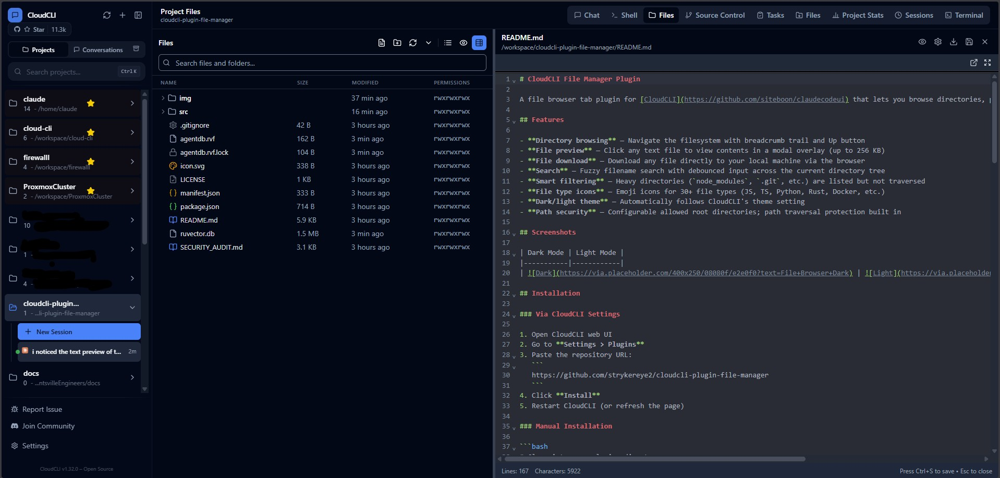
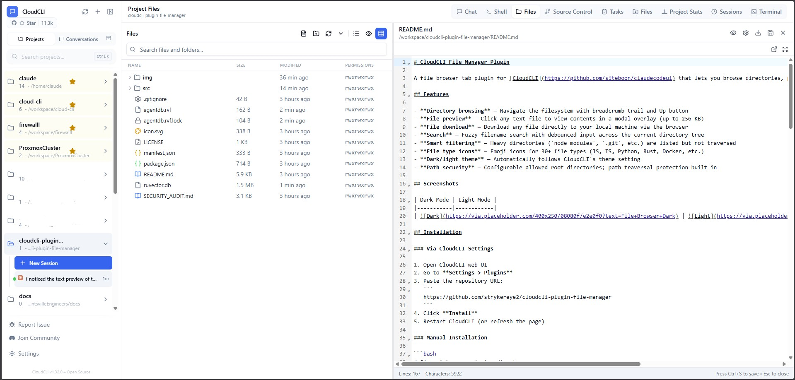

# CloudCLI File Manager Plugin

A file browser tab plugin for [CloudCLI](https://github.com/siteboon/claudecodeui) that lets you browse directories, preview text files, and download files — all without leaving the web UI.

## Features

- **Directory browsing** — Navigate the filesystem with breadcrumb trail and Up button
- **File preview** — Click any text file to view contents in a modal overlay (up to 256 KB)
- **File download** — Download any file directly to your local machine via the browser
- **Search** — Fuzzy filename search with debounced input across the current directory tree
- **Smart filtering** — Heavy directories (`node_modules`, `.git`, etc.) are listed but not traversed
- **File type icons** — Emoji icons for 30+ file types (JS, TS, Python, Rust, Docker, etc.)
- **Dark/light theme** — Automatically follows CloudCLI's theme setting
- **Path security** — Configurable allowed root directories; path traversal protection built in

## Screenshots

| Dark Mode | Light Mode |
|-----------|------------|
|  |  |

## Installation

### Via CloudCLI Settings

1. Open CloudCLI web UI
2. Go to **Settings > Plugins**
3. Paste the repository URL:
   ```
   https://github.com/strykereye2/cloudcli-plugin-file-manager
   ```
4. Click **Install**
5. Restart CloudCLI (or refresh the page)

### Manual Installation

```bash
# Clone into your plugins directory
cd ~/.claude-code-ui/plugins
git clone https://github.com/strykereye2/cloudcli-plugin-file-manager file-manager

# Register in plugins.json
node -e "
  const fs = require('fs');
  const p = process.env.HOME + '/.claude-code-ui/plugins.json';
  let cfg = {};
  try { cfg = JSON.parse(fs.readFileSync(p, 'utf8')); } catch {}
  cfg['file-manager'] = { name: 'file-manager', source: 'local', enabled: true };
  fs.writeFileSync(p, JSON.stringify(cfg, null, 2));
  console.log('Registered file-manager plugin');
"
```

### Docker Integration

If you're baking this into a Docker image, copy the plugin files at build time and register at runtime:

```dockerfile
# Dockerfile
COPY plugins/file-manager /home/user/.claude-code-ui/plugins/file-manager
```

```bash
# Runtime registration (e.g., in an entrypoint script)
node -e "
  const fs = require('fs');
  const p = '/home/user/.claude-code-ui/plugins.json';
  let cfg = {};
  try { cfg = JSON.parse(fs.readFileSync(p, 'utf8')); } catch {}
  if (!cfg['file-manager']) {
    cfg['file-manager'] = { name: 'file-manager', source: 'local', enabled: true };
    fs.writeFileSync(p, JSON.stringify(cfg, null, 2));
  }
"
```

## Configuration

### Environment Variables

| Variable | Description | Default |
|----------|-------------|---------|
| `FILE_MANAGER_ROOTS` | Comma-separated list of allowed root directories | `$HOME,/tmp` |
| `FILE_MANAGER_DEFAULT_PATH` | Starting directory when the plugin opens | First entry in `FILE_MANAGER_ROOTS` |

**Example:**

```bash
export FILE_MANAGER_ROOTS="/workspace,/home/myuser,/tmp,/data"
export FILE_MANAGER_DEFAULT_PATH="/workspace"
```

### Security Model

The plugin enforces a strict path allowlist:

1. **Allowed roots** — Only directories under `FILE_MANAGER_ROOTS` are accessible
2. **Path traversal protection** — All paths are resolved to absolute before checking against the allowlist
3. **No symlink escape** — `lstat` is used for directory listings; symlinks are flagged but not followed outside roots
4. **Hidden directory filtering** — `.git/objects`, `.git/pack`, and `node_modules/.cache` are automatically excluded
5. **Skip heavy directories** — `node_modules`, `.git`, `__pycache__`, `.venv`, `coverage`, `.turbo` are listed but not traversed during search

## API Endpoints

The plugin server exposes these endpoints (accessed via CloudCLI's plugin RPC proxy):

| Method | Endpoint | Description |
|--------|----------|-------------|
| `GET` | `/list?path=<dir>` | List directory contents |
| `GET` | `/info?path=<file>` | Get file metadata + text preview |
| `GET` | `/download?path=<file>` | Download file with correct MIME type |
| `GET` | `/search?root=<dir>&q=<query>` | Search filenames (max 100 results, 6 levels deep) |

## Plugin Architecture

```
cloudcli-plugin-file-manager/
├── manifest.json       # Plugin metadata (name, slot, entry points)
├── icon.svg            # Tab icon (folder with download arrow)
├── src/
│   ├── server.js       # Node.js HTTP backend (list, info, download, search)
│   └── index.js        # Frontend UI (mount/unmount exports)
├── dist/
│   ├── server.js       # Production copy of server
│   └── index.js        # Production copy of frontend
├── package.json
├── LICENSE             # MIT
└── README.md
```

### How CloudCLI Plugins Work

- **`manifest.json`** — Declares the plugin name, type (`module`), slot (`tab`), and entry points
- **`server`** entry — CloudCLI spawns this as a child process; it prints `{"ready": true, "port": N}` to stdout
- **`entry`** — Frontend module that exports `mount(container, api)` and `unmount(container)`
- **`api.rpc(method, path, body)`** — Proxied to the server process via CloudCLI's plugin RPC
- **`api.context`** — Provides theme, project path, session info
- **`api.onContextChange(cb)`** — Subscribe to theme/project changes

## Development

```bash
# Clone the repo
git clone https://github.com/strykereye2/cloudcli-plugin-file-manager
cd cloudcli-plugin-file-manager

# Build (copies src → dist)
npm run build

# Test the server standalone
node dist/server.js
# Outputs: {"ready":true,"port":XXXXX}

# Then test endpoints:
curl http://127.0.0.1:XXXXX/list?path=/tmp
curl http://127.0.0.1:XXXXX/search?root=/tmp&q=test
```

## Requirements

- **CloudCLI** v0.3.0+ (plugin system support)
- **Node.js** v18+ (uses ES modules, `node:` imports)

## License

MIT — see [LICENSE](LICENSE).
